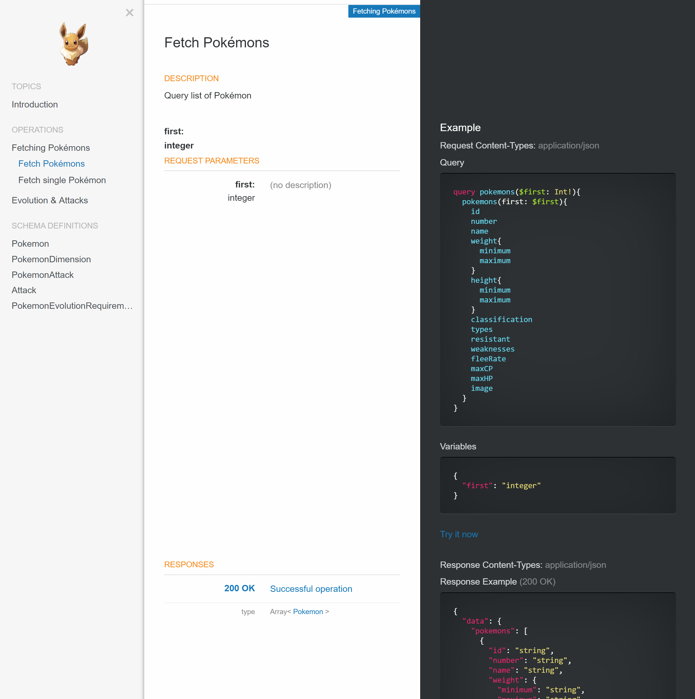

# DociQL

> A nice fork of [Spectacle](http://sourcey.com/spectacle)

DociQL generates beautiful static HTML5 documentation from a [GraphQL](https://graphql.org) endpoint using the introspection query.

The goal of DociQL is help you "save time and look good" by providing an extensible platform for auto generating your API documentation. The default layout is a three column single page, similar to those
employed by [Stripe](https://stripe.com/docs/api) and [Intercom](https://developers.intercom.com/reference).

See a demo of DociQL in action here: [https://wayfair.github.io/dociql/](https://wayfair.github.io/dociql/)

---



---

## Features

* Uses the introspection query to fetch a schema of GraphQL and generates documentation on the fly.
* Generates an example request and response with "Try it now" links.
* Allows the user to define use cases and group them by domain.
* **Highly configurable**: Easily configurable Handlebars templates and SCSS styles so you can add your own design and flavour without going bald. See [Custom Builds](#custom-builds).
* **Markdown support**: Render markdown written in any of your API descriptions.
* **Clean, responsive design**: Responsive HTML5 and CSS3 layout built with [Foundation 6](http://foundation.zurb.com/sites.html) that looks great on all devices and screen sizes.
* **Embed into your existing website**: An embedded option so that you can generate partial docs without a HTML `<body>` tag for convenient integration into your existing website.
* **Live preview developer mode**: Development mode that starts a local HTTP server with a file watcher and live reload, so you can preview live changes in your browser as you update your specification.

## Usage

### Install DociQL from `npm`:

```bash
npm install -g dociql
```


### Define `config.yml` template to help generate beautiful docs:
```yml
# To fetch schema from
introspection: https://url-to-you-graphql-endpoint

servers: # same format as for OpenAPI Specification
  - url: https://dev-server.com
    description: Dev
  - url: https://prod-server.com
    description: Prod
    ...

info: # same format as for OpenAPI Specification
    title: Your API Title
    description: Markdown enabled description of your api.    
    ...

 # define your domains by providing a set of usecases
domains:
  - name: Top Level Menu Section # Name of the domain
    description: Description  # Description of the domain
    usecases:         
     - name: Fetch 'Some' field # Operation name
       description: Markdown enabled description for operation # Opearation description
       query: query.some # Query example - fetching single field
       select: field1 field2 # select only specific sub fields. By default - all are selected
       expand: field3(sub1, sub2, sub3),field4 # go deep by expanding specific fields.
     - name: Invoke Mutation # Mutation 
       description: Markdown enabled description for operation
       query: mutation.mutateSome # Mutation example - invoke mutation
```
### Pass your `config.yml` document to generate your documentation:

```bash
dociql -d config.yml
```

Your generated documentation will be located in the `public` directory by default. You can either copy the generated HTML to your web server, or view your docs by pointing your browser to [http://localhost:4400/](http://localhost:4400/).

### Docker

> Coming soon!

## Configuration Options

The basic CLI options are detailed below:

```bash
$ dociql -h

  Usage: dociql [options] <dociql.yaml>

  Options:

    -h, --help                   output usage information
    -V, --version                output the version number
    -C, --disable-css            omit CSS generation (default: false)
    -J, --disable-js             omit JavaScript generation (default: false)
    -e, --embeddable             omit the HTML <body/> and generate the documentation content only (default: false)
    -d, --development-mode       start HTTP server with the file watcher (default: false)
    -D, --development-mode-live  start HTTP server with the file watcher and live reload (default: false)
    -s, --start-server           start the HTTP server without any development features
    -p, --port <port>            the port number for the HTTP server to listen on (default: 4400)
    -P, --port-live <port>       the port number for the live reload to listen on (default: 4401)
    -t, --target-dir <dir>       the target build directory (default: public)
    -f, --target-file <file>     the target build HTML file (default: index.html)
    -a, --app-dir <dir>          the application source directory (default: app)
    -l, --logo-file <file>       specify a custom logo file (default: null)
    -c, --config-file <file>     specify a custom configuration file (default: app/lib/config.js)
```

Most options are self explanatory, but the following options warrant some further explanation:

* **--development-mode** `-d`: This option starts a development server with a file watcher, and will automatically regenerate your docs when any of your spec or app files change.

* **--development-mode-live** `-D`: This option starts a development server with a file watcher and live reload, and will automatically regenerate your docs when any of your spec or app files change.

* **--start-server** `-s`: This option starts a production server without any development options enabled that serves the contents of your `--target-dir`.

* **--embeddable** `-e`: This option lets you build a minimal version of the documentation without the HTML `<body>` tags, so you can embed DociQL into your own website template. More info on [Custom Builds](#custom-builds) here.

* **--app-dir** `-a`: This option overrides the default directory which contains all the Handlebars templates, SCSS, and JavaScript source files. This option is useful for development because you can copy the contents of `app` to a remote location or a separate repo for custom builds.

* **--target-dir** `-t`: This option specifies where the generated documentation HTML files will be output.

## Custom Builds

The best option for building your own custom functionality into DociQL is to [fork DociQL on GitHub](https://help.github.com/articles/fork-a-repo/) and make your own modifications in the source. This way, you can keep up-to-date by merging changes from the `master` branch and you can also contribute your updates back to `master` by creating a [Pull Request](https://help.github.com/articles/creating-a-pull-request/), especially if you think they'll be an improvement for DociQL.

To fork DociQL go to `https://github.com/wayfair/dociql` and press the 'Fork' button. Now you can `git clone git@github.com:<yourname>/dociql.git` to make your own changes.

Alternatively, you can just copy the contents of `app` from the main repo which contains all of the source files such as templates, stylesheets, and JavaScripts. Now, just pass the path from your custom `app` path to the CLI like so: `dociql -a dociql.json`.

## Optimizing Your Workflow

Using an API spec to generate your documentation has a number of great advantages, such as:

* **Maintain a single source**: Save time by removing the need to maintain a separate API spec and API documentation.
* **No more out-of-date documentation**: Your documentation will always be up-to-date with your API spec.
* **Be a better developer**: Your entire API system will be more stable and robust when built around your spec as a single source of truth.

## Development

### Testing

> Coming soon!

Testing is powered by [Mocha](https://mochajs.org/)/[Chai](http://chaijs.com/) and automated testing is run via [CircleCI](https://circleci.com/).

At this stage, unit tests have not been written for all parts of the codebase.  However, new code should be tested, and unit tests for the existing code will be added in the future.

Run `npm test` on the repository to start the automated tests. Some parts of testing can be configured using environment variables.

- `OFFLINE=true`
  Some tests use HTTP connections to test, giving DociQL remote API specifications. Use `OFFLINE=true` to skip tests that require an internet connection.

Include environment variables before calling `npm test`.  For example, `OFFLINE` mode can be enabled via `OFFLINE=true npm test`.


<!-- ## Contributors

Thanks to all the great developers who make DociQL great!

TODO
-->


## License

DociQL is licensed under the Apache License 2.0 – see the [LICENSE.md](https://github.com/wayfair/dociql/blob/master/LICENSE) for specific details.

## More Information

More info is available on the [DociQL homepage](https://github.com/wayfair/dociql).

Please use the [GitHub issue tracker](https://github.com/sourcey/spectacle/issues) if you have any ideas or bugs to report.

All contributions are welcome.

Good luck and enjoy DociQL!
